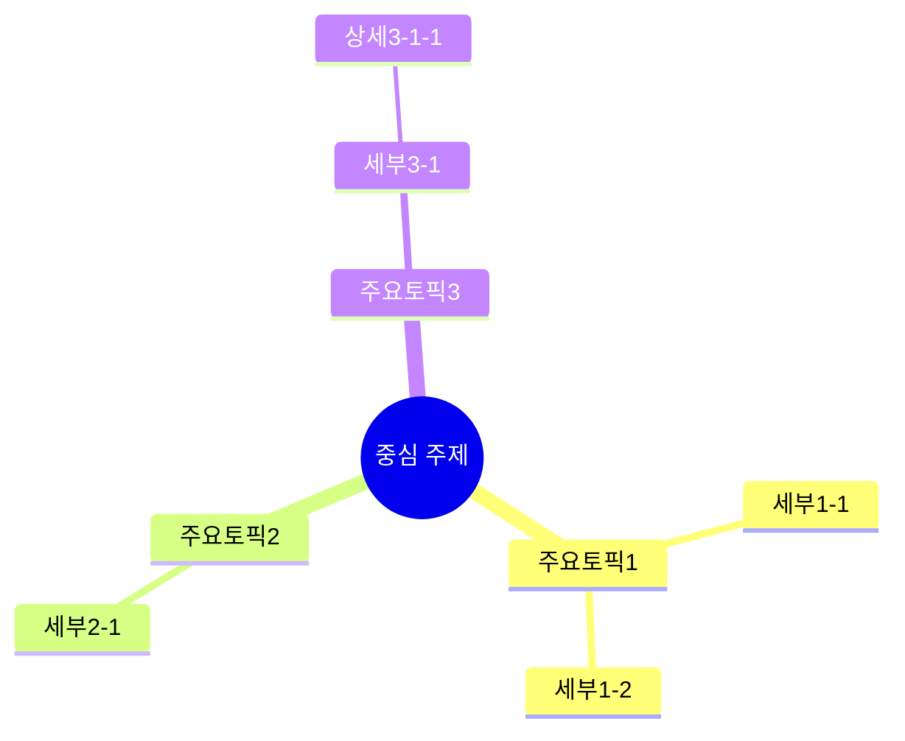

# Note Templates Reference

노트 형식별 상세 가이드입니다.

## Common Elements (모든 형식 공통)

### 메타 정보 블록
```markdown
## 메타 정보
- 출처: [URL 또는 파일명]
- 채널/저자: [[채널명 또는 저자명]]
- 유형: [YouTube/PDF/웹페이지/비디오]
- 길이/분량: [시간 또는 페이지 수]
- 추출 품질: [점수]/100
- 생성일: [YYYY-MM-DD]
```

### 태그 및 관련 개념
```markdown
## 태그
#카테고리 #주제1 #주제2

## 관련 개념
- [[핵심개념1]] - 간단 설명
- [[핵심개념2]] - 간단 설명
```

### 인용 형식
| 소스 유형 | 형식 | 예시 |
|-----------|------|------|
| YouTube/Video | `[MM:SS]` 또는 `[HH:MM:SS]` | `[05:30]`, `[1:23:45]` |
| PDF | `[p.N]` | `[p.15]`, `[pp.15-17]` |
| Web | `[섹션명]` | `[Introduction]` |

---

## Detailed (상세 노트)

### 목적
원본 콘텐츠의 모든 중요 내용을 계층적으로 구조화한 완전한 학습 노트.

### 구조
```markdown
# [제목]

[YouTube 임베딩 - 해당 시]

## 메타 정보
...

## 태그
...

## 관련 개념
...

---

## 목차
1. [섹션1]
2. [섹션2]
...

---

## 1. [첫 번째 주제] [시작 타임스탬프]

### 1.1 [소주제]
- 핵심 내용 [HH:MM:SS]
- 상세 설명 [HH:MM:SS]
  - 구체적 예시
  - 추가 설명

### 1.2 [소주제]
- 내용 [HH:MM:SS]

## 2. [두 번째 주제]
...

---

## 핵심 요점 정리
1. [가장 중요한 포인트] [출처]
2. [두 번째 포인트] [출처]
...

---

## 원문 스크립트

<details>
<summary>전체 원문 보기</summary>

[원문 전체]

</details>
```

### 특징
- 계층: 1. → 1.1 → 1.1.1 (최대 3단계)
- 커버리지: 80-100%
- 완전한 문장으로 작성
- 모든 예시와 세부사항 포함

---

## Essence (핵심 노트)

### 목적
복잡한 콘텐츠에서 핵심 개념만 추출한 압축 노트.

### 구조
```markdown
# [제목] - 핵심 노트

[YouTube 임베딩]

## 메타 정보
...

## 태그
...

## 관련 개념
...

---

## 한 문장 요약
[전체 내용을 한 문장으로]

---

## 핵심 포인트

### 1. [핵심 개념 1] [HH:MM:SS]
[2-3문장 설명]

### 2. [핵심 개념 2] [HH:MM:SS]
[2-3문장 설명]

... (5-10개)

---

## 개념 관계도

```
[중심 개념]
    ├── [하위 1]
    │   ├── [세부 1-1]
    │   └── [세부 1-2]
    └── [하위 2]
```

---

## 핵심 인용구
> "[원문에서 가장 중요한 문장]" [HH:MM:SS]

---

## 다음 단계
(원문에 언급된 경우만)
- [실천 항목] [출처]
```

### 특징
- 5-10개 핵심 포인트
- 커버리지: 30-40%
- 개념 간 관계 명시
- 핵심 인용구 포함

---

## Easy (쉬운 노트)

### 목적
초보자도 이해할 수 있는 단순화된 요약.

### 구조
```markdown
# [제목] - 쉬운 노트

[YouTube 임베딩]

## 메타 정보
- 채널/저자: [[채널명]]

## 태그
...

---

## 이 콘텐츠는요...
[2-3문장으로 전체 내용을 쉽게 설명]

---

## 꼭 알아야 할 것

### 1. [첫 번째 핵심]
[쉬운 설명 2-3문장]
- 쉽게 말하면: [더 쉬운 비유]

### 2. [두 번째 핵심]
[쉬운 설명 2-3문장]

### 3. [세 번째 핵심]
[쉬운 설명 2-3문장]

---

## 한 줄 정리
> [가장 중요한 메시지]

---

## 용어 설명
(전문 용어가 있는 경우)
- **[용어]**: [쉬운 설명]
```

### 특징
- 3-5개 핵심 포인트만
- 커버리지: 10-20%
- 전문 용어 → 일상 언어
- 비유와 쉬운 예시 사용

---

## Mindmap (마인드맵)

### 목적
콘텐츠 구조를 시각적으로 표현.

### 구조
```markdown
# [제목] - 마인드맵

[YouTube 임베딩]

## 메타 정보
...

## 태그
...

## 관련 개념
...

---

## 마인드맵



---

## 텍스트 버전

```
[중심 주제]
├── 주요토픽1
│   ├── 세부1-1
│   └── 세부1-2
├── 주요토픽2
│   └── 세부2-1
└── 주요토픽3
    └── 세부3-1
        └── 상세3-1-1
```

---

## 노드 설명

| 노드 | 설명 | 출처 |
|------|------|------|
| 주요토픽1 | [간단 설명] | [HH:MM:SS] |
| 주요토픽2 | [간단 설명] | [HH:MM:SS] |
```

### 특징
- Mermaid mindmap 문법 사용
- 노드당 3-7 단어
- 최대 3계층 깊이
- 텍스트 대체 버전 포함

### Mermaid 노드 스타일
- `((텍스트))` - 원형 (중심 노드)
- `(텍스트)` - 둥근 사각형
- `[텍스트]` - 사각형
- `텍스트` - 기본
