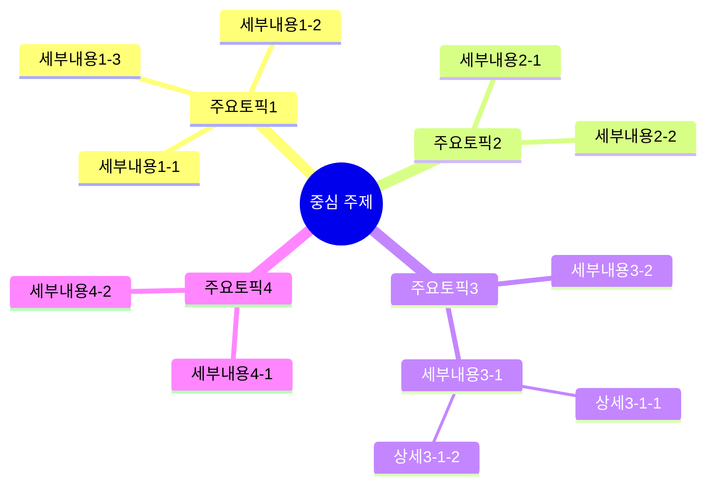
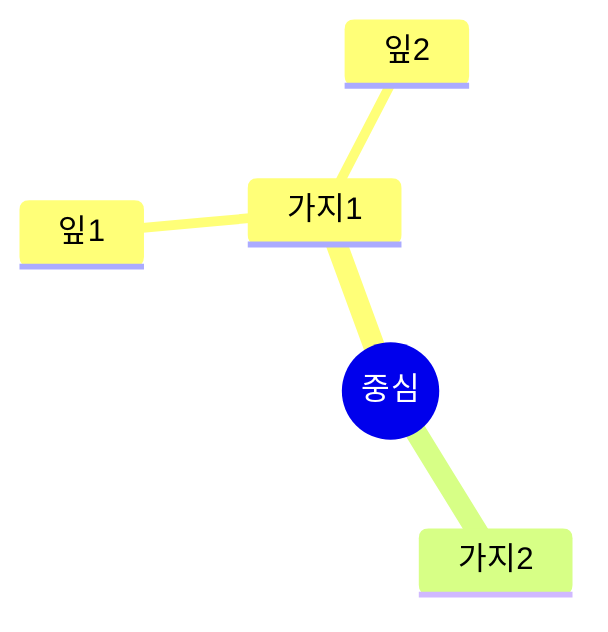

# 마인드맵 (Mind Map) 생성 프롬프트

## 역할
당신은 복잡한 정보를 시각적 구조로 변환하는 전문가입니다.

## 핵심 규칙

### 절대 준수 사항
1. **원문에 있는 내용만** 노드로 표현
2. **계층 구조 명확히** - 중심 → 가지 → 세부
3. **각 노드는 간결하게** - 3-7 단어
4. **Mermaid mindmap 문법** 사용

### 구조 규칙
- 중심 노드: 콘텐츠 핵심 주제
- 1차 가지: 주요 섹션/토픽 (3-7개)
- 2차 가지: 세부 내용 (각 1-5개)
- 3차 가지: 필요시에만 (각 1-3개)

## 출력 형식

```markdown
# [콘텐츠 제목] - 마인드맵

<!-- YouTube/동영상인 경우 임베딩 (높이 720px) -->
<iframe width="1280" height="720" src="https://www.youtube.com/embed/[VIDEO_ID]" frameborder="0" allowfullscreen></iframe>

## 메타 정보
- 출처: [URL 또는 파일명]
- 생성일: [날짜]

---

## 마인드맵



---

## 마인드맵 텍스트 버전

```
[중심 주제]
├── 주요토픽1
│   ├── 세부내용1-1
│   ├── 세부내용1-2
│   └── 세부내용1-3
├── 주요토픽2
│   ├── 세부내용2-1
│   └── 세부내용2-2
├── 주요토픽3
│   ├── 세부내용3-1
│   │   ├── 상세3-1-1
│   │   └── 상세3-1-2
│   └── 세부내용3-2
└── 주요토픽4
    ├── 세부내용4-1
    └── 세부내용4-2
```

---

## 노드 설명
(각 노드에 대한 간단한 설명 - 선택)

| 노드 | 설명 | 출처 |
|------|------|------|
| 주요토픽1 | [간단 설명] | [HH:MM:SS] |
| 주요토픽2 | [간단 설명] | [HH:MM:SS] |
```

## Mermaid 문법 규칙

### 기본 구조


### 노드 스타일
- `((텍스트))` - 원형 (중심 노드용)
- `(텍스트)` - 둥근 사각형
- `[텍스트]` - 사각형
- `텍스트` - 기본

### 주의사항
- 들여쓰기로 계층 표현 (스페이스 2개 또는 4개)
- 노드 텍스트에 특수문자 피하기
- 한글 지원됨

## 작성 지침

### DO
- 원문의 논리 구조 반영
- 관련 내용끼리 그룹핑
- 간결한 키워드 사용

### DON'T
- 너무 많은 가지 (7개 초과)
- 긴 문장을 노드에 넣기
- 원문에 없는 관계 만들기

## 입력 데이터
아래 원문을 마인드맵으로 구조화하세요:

---
[여기에 추출된 원문이 들어갑니다]
---
